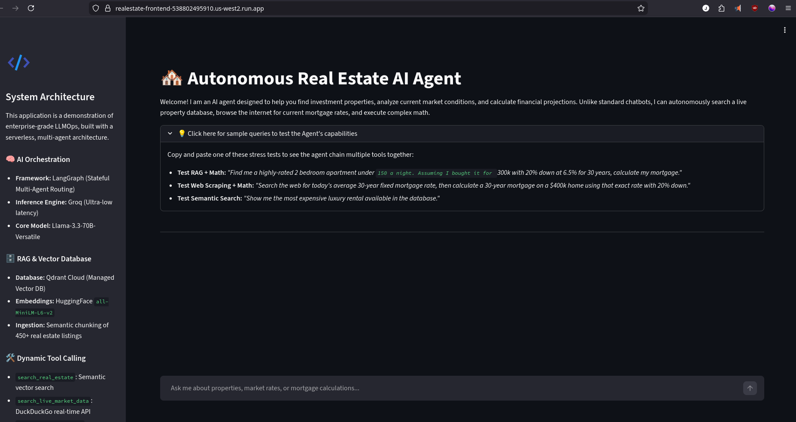
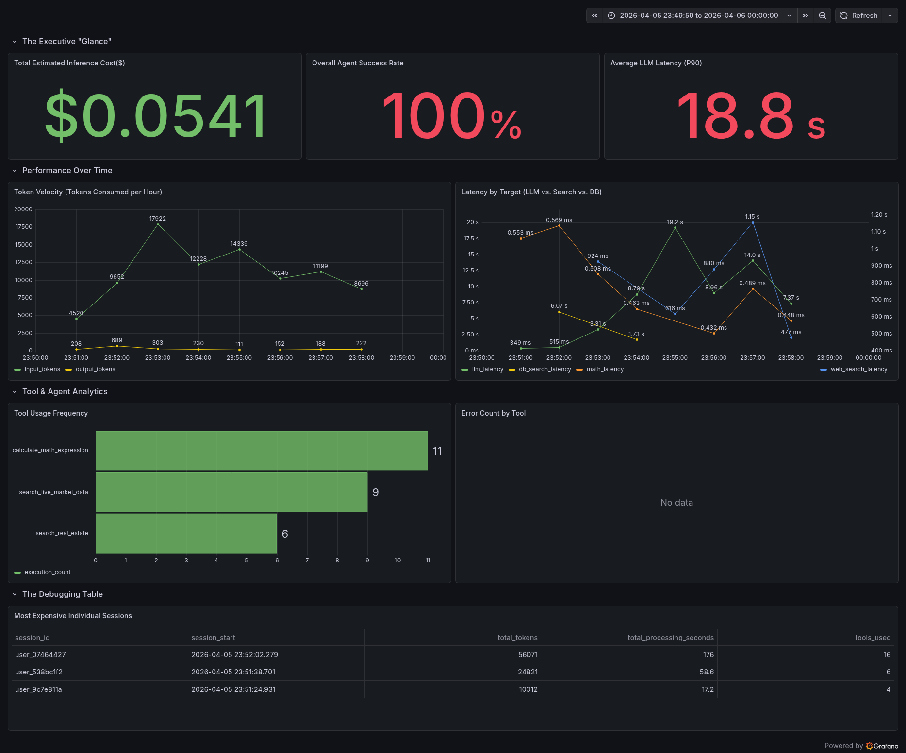

# 🏘️ Serverless Real Estate AI Agent: Multi-Tool Orchestrator



## 📌 Executive Summary
Standard Large Language Models (LLMs) hallucinate financial calculations and lack real-time market awareness, making them dangerous for high-stakes real estate and financial applications. 

This project is a **production-grade, autonomous multi-agent system** designed to solve these limitations. Instead of relying on a single prompt, this architecture utilizes a state machine (LangGraph) to dynamically route user queries to specialized micro-tools, ensuring zero-hallucination math and live data retrieval. Deployed entirely on serverless infrastructure, the system scales to zero and features a comprehensive custom LLMOps observability pipeline.

---

## 🚀 Engineering Highlights

* **Multi-Agent Orchestration:** Implemented **LangGraph** to manage stateful routing between a Llama-3.3-70B worker node (for reasoning) and specialized execution tools.
* **Custom RAG Pipeline:** Engineered a semantic search pipeline using **HuggingFace** embeddings (`all-MiniLM-L6-v2`) and **Qdrant Cloud**, processing and retrieving highly structured real estate listings.
* **Dynamic Tool Calling:** Built custom Python tools for live web scraping (DuckDuckGo API + BeautifulSoup semantic parsing) and a sandboxed, secure Python math evaluator to handle complex mortgage formulas intrinsically.
* **Serverless Infrastructure:** Containerized the FastAPI backend and Streamlit frontend using **Docker**, deploying to **Google Cloud Run** for a highly available, scale-to-zero architecture that minimizes idle costs.
* **Enterprise Observability (LLMOps):** Built a non-blocking, asynchronous telemetry pipeline using Python threading that streams token economics, tool success rates, and P90 latency metrics directly to **Google BigQuery**, visualized via a custom **Grafana** dashboard.

---

## 📊 LLMOps & Observability Control Plane

A critical component of this architecture is the custom telemetry engine. Relying on managed APIs for observability can be expensive; instead, this project uses a background threaded interceptor to capture raw graph execution events without adding latency to the user's request.



**Key Metrics Tracked:**
* **Token Velocity & Cost Estimation:** Real-time tracking of prompt/completion tokens consumed per session.
* **P90 Latency Tracking:** Granular latency metrics split by target (LLM reasoning vs. Vector DB lookup vs. Web Scraping).
* **Tool Usage & Error Rates:** Identifies which micro-tools are heavily utilized and catches silent execution failures.

---

## 🧠 System Architecture & Tech Stack

### AI & Orchestration
* **Framework:** LangChain & LangGraph
* **Inference Engine:** Groq (Llama-3.3-70B-Versatile)
* **Embeddings:** HuggingFace `all-MiniLM-L6-v2`
* **Vector DB:** Qdrant (Managed Cloud / Local Docker)

### Backend & Infrastructure
* **API Framework:** FastAPI & Uvicorn
* **Containerization:** Docker & Docker Compose
* **Cloud Deployment:** Google Cloud Run (Serverless)
* **Observability:** Google BigQuery & Grafana

### Micro-Tools Inventory
1. `search_real_estate`: Executes cosine-similarity searches against the Qdrant database to find matching properties.
2. `search_live_market_data`: Uses DDGS to find current mortgage rates and live market news.
3. `extract_text_from_url`: A custom HTML parser that strips bloat (navbars/JS) and extracts dense semantic context.
4. `calculate_math_expression`: A tightly sandboxed `eval()` environment allowing the LLM to execute raw mathematical formulas (e.g., compound interest, mortgage amortization).

---

## 📂 Repository Structure

```
.
├── assets/                             # Architecture diagrams and UI screenshots
├── backend/
│   ├── agent/                          # LangGraph state machine, tools, and telemetry
│   ├── database/                       # Qdrant client initialization and schemas
│   ├── scraper/                        # CSV ingestion and semantic chunking scripts
│   ├── main.py                         # FastAPI application entry point
│   └── Dockerfile                      # Backend container blueprint (pre-bakes HF models)
├── frontend/
│   ├── app.py                          # Streamlit interactive portfolio UI
│   └── Dockerfile                      # Frontend container blueprint
├── docker-compose.yml                  # Local orchestrator for DB, API, UI, and Grafana
├── generate_traffic.py                 # Synthetic load generator for dashboard population
└── requirements.txt                    # Python dependencies
```

---

## 💻 Local Development Setup

To run this complex multi-container architecture on your local machine, ensure you have Docker and Docker Compose installed.

### 1. Environment Variables
Create a `.env` file in the root directory:
```env
GROQ_API_KEY=your_groq_api_key_here
HF_TOKEN=your_huggingface_token_here
# Optional: Connect to cloud Qdrant instead of local
# QDRANT_URL=[https://your-cluster.qdrant.tech](https://your-cluster.qdrant.tech)
# QDRANT_API_KEY=your_qdrant_api_key
```

### 2. Boot the Infrastructure
This command spins up the Qdrant Vector DB, the FastAPI backend, the Streamlit frontend, and the Grafana instance.
```bash
docker-compose up --build -d
```

### 3. Ingest the Data
Load the real estate property dataset into the vector database.
```bash
docker exec -it <backend_container_name> python -m backend.scraper.ingest
```

### 4. Access the Services
* **Frontend UI:** `http://localhost:8501`
* **FastAPI Docs:** `http://localhost:8000/docs`
* **Grafana Dashboard:** `http://localhost:3000` (Default login: `admin`/`admin`)
* **Qdrant Dashboard:** `http://localhost:6333/dashboard`

---

## ☁️ Cloud Deployment (Google Cloud Run)

This project is optimized for Google Cloud Run's serverless architecture, enabling infinite horizontal scaling while strictly capping costs to zero during idle periods.

```bash
# 1. Build and deploy the backend API
gcloud run deploy realestate-backend \\
  --source . \\
  --platform managed \\
  --allow-unauthenticated \\
  --port 8000 \\
  --max-instances 2 \\
  --set-env-vars "GROQ_API_KEY=your_key,QDRANT_URL=your_url,QDRANT_API_KEY=your_key"

# 2. Build and deploy the Streamlit frontend
gcloud run deploy realestate-frontend \\
  --source . \\
  --platform managed \\
  --allow-unauthenticated \\
  --port 8501 \\
  --max-instances 2 \\
  --set-env-vars "API_URL=https://<your-backend-url>/api/v1/query"
```
